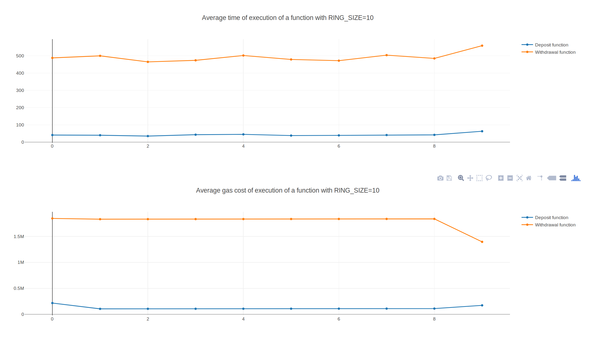

# Benchmark

## Run the benchmark

1. Run: `npm run-script benchmark`. This command starts the benchmark and writes the averaged result of the different iterations in the `benchmark.txt` file.
2. Once the benchmark has finished, the result can be visualized in your bowser by launching the `plots.html` file. This can be done dorectly from the terminal by running `firefox plots.html` or `google-chrome plots.html` for instance.

## Pre-requisites

In order to avoid introducing biases in the benchmark, we decided to do all the orbital-related commands before actually calling the functions of the `Mixer.sol` contract.

_Note:_ In order to have an idea of the performances of the `Mixer` contract, we did a `BenchmarkMixer` contract whose functions have the same signatures as the `Mixer` contract. However, its functions emit an event and return directly. This `BenchmarkMixer` contract aims to measure to help us measuring **ONLY** the overhead introduced by the `Mixer`'s functions logic (ie: Measuring the time that each fiunction of the Mixer costs).

## Results for a RING\_SIZE of 10

**IMPORTANT:** To run a benchmark on different sizes of ring, 3 parameters have to be changed manually:
1. In `contracts/LinkableRing.sol`, change the value of the variable `RING\_SIZE`
2. In `benchmark/index.js`, change the value of the global variable `ringSize` to the same value as the `RING\_SIZE` previously set
3. If you want to change the number of time each operation is repeated, you can also change the value of the variable `numberOfRings` in `benchmark/index.js`.

### Summary

The result of the benchmark is represented in the following JSON object (written in `benchmark.txt`):
```javascript
var result = {
    "deposit": {
        "timeArray":[57,48,41,58,44,43,45,51,49,62],
        "gasArray":[216668,104984,105832,106594,107400,108184,108925,109709,110536,157867]
    },
    "withdraw": {
        "timeArray": [519,505,534,513,514,553,514,522,547,588],
        "gasArray": [1844601,1830584,1831247,1831911,1832702,1833579,1834263,1835140,1835867,1394059]
    }
}
```

This variable contains the averaged values from multiple tests on different rings of `RING\_SIZE=10` (Value set in the `LinkableRing.sol` contract)

Here is the array that summurazises the benchmark:

|Operation|Average Time (ms)|Average Gas cost (gas)|
|----|----|----|
|Deposit|49.8|123669.9|
|Withdraw|530.9|1790395.3|


### Associated visualization



## Interpretation of the results

### Deposit

Once the benchmark has ran, open the `plots.html` into your browser. In theory, you should see that the time to run `Deposit` is higher for the first request. This is normal because, when we look at the code of the `Mixer`, it creates a ring of the good denomination for at the first request. Likewise, the last Deposit request takes also a bit lomger than the average because when the ring is full, the `Mixer` contract runs a few additional instructions in order to emit a `MixerReady` event. 
While, we would need more investigation, we believe that if the `RING_SIZE` of the `Mixer` is extremely big (1000/10000 or even more), the cost (in time and in gas) could grow linearly with the request index. Indeed, when someone invokes the `Deposit` function, he/she sends the stealth public key of the recipient to the Mixer. that way the mixer can constitute the ring. However, by looking at the code source of the `Mixer`, we see that the Mixer does a lookup in the ring to see whether the attached stealth public key doesn't already exists in the ring. Thus as the deposits happen, the ring has to look into a larger set of keys. This takes more time and thus might cost more gas.

### Withdraw

On average all withdrawals have the same cost in time/gas. However, it appears clearly on the plot that the last Withdrawal operation costs much less than the rest of the withdrawals. This is due to the fact that the last withdrawal triggers the "death" of the ring, and thus trigers the deletion of the ring keys (which frees storage on the blockchain). Since some storage is freed, the last recipient to invoke the `Withdraw` function benefits from an lower gas cost.


## Further benchmark functions to implement

1. Measure the time/gas it takes to do only one Deposit (time span between Alice calling the Contract's function and receiving the MixerDeposit event) **DONE**
2. Same with Withdrawal **DONE**
3. Flow of TXs of 2 different denominations sent in an alternating manner
4. try to run the benchmark for an enormous RING\_SIZE7
5. Multiple concurrent big rings
6. Look into *Edge case tests* to find the correlation between time increase (and gas consumption) and the ring size (The idea here is to plot the graph x = size of ring and y = f(x) = time (average time))


## Raw Reflexions

- There is a balance to find between ring denomination and ring size:
    - Privacy issue and side channel leaks for big denominations (bank transfer) --> If a bank wants to do a transfer of 100 million dollars through Mobius, then it might be possible for someone analyzing the blockchain to actually infer that this transfer has been done by some banks or "big fishs" that has done such a transfer, so banks might want to split big transfers into a huge set of small ones --> Need to have big rings --> Big rings are good for privacy but also harder to fill
    - Too large ring sizes can be hard to fill and Bob might need to wait for days for the ring to be complete (time problem)
    - Might need to monitor the rings (priority between rings that have to be filled ?)
    - "Decloak key" feature for legal reasons ?
